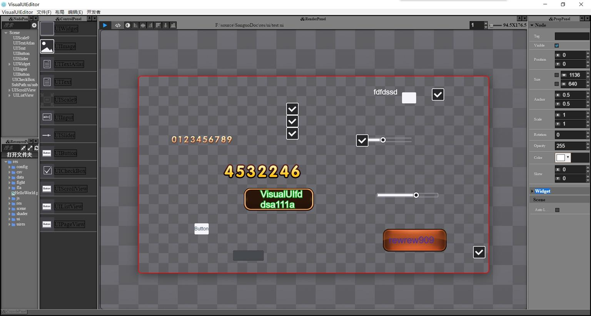

#VisualUIEditor

An UIEditor for Game, base on electron.

#install
> install node.js first

> npm install -g electron-prebuilt

> npm install -g bower

> bower install

> npm install

#run
open shell in project root and run
> electron .

#start with project
菜单->文件->打开项目(选择目录底下的project-test)即可进行测试

#基于项目
基本electron跨平台，wcDocker的dock组件，及cocos-html5的渲染层

#已实现的功能
------------------------
* 控件拖拽使用
* 控件的快速移动，缩放，属性更改
* 图片的快速预览
* 坐标点，快速的定位当前鼠标对应的坐标
* 画布大小的快速调整，画布快速的缩放
* 布局的源码查看更改，更适合程序员使用
* 强大的撤销反撤销功能，让您更无需害怕误操作
* 资源布局的嵌套使用
* 页签功能，让您可以同时打开多个UI文件
* 多语言方案支持，助力您的全球游戏

#布局相关
* 节点布局，管理游戏布局的一些节点相关的面板，可支持快速复制及上下移动
* 资源布局，显示您项目中的资源文件，让您可以快速的创建新的UI文件相关
* 控制布局，这里显示您常用的一些节点，让您可以快速的拖动节点进行创建
* 控制台布局，这里显示一些编辑器的信息，让您知道编辑器当前的状态
* 属性布局，您可以选中某个节点，这里将显示节点的具体属性，您可以通过它快速的修改节点属性
* 渲染布局，这里为编辑器的核心布局，这里每个页签下对应着一个Scene，这里将显示您的整体展示图，这也是您在游戏中将显示的效果图，当然做为程序猿的我们也可以快速的通常源码模式快修的修改我们的布局，然后再切换成设计模式预览效果

#文档信息
[如何使用](./doc/howtouse.md "如何使用")

[UI文件详解](./doc/uidetail.md "UI文件详解")

[撤消反撤消](./doc/redoundo.md "撤消反撤消实现细节")

#Runtime
支持cocos2dx的应用(当前支持Lua及CPP)
[cocos2dx runtime](https://github.com/tickbh/VisualUIEditor_2dx_runtime "cocos2dx runtime")

#其它信息
**VisualUIEditor开发QQ群欢迎您的加入: 453224679**

# Copyright & License

© 2015-2016 tickbh (tickdream125@hotmail.com) - Released under the [MIT license](LICENSE).